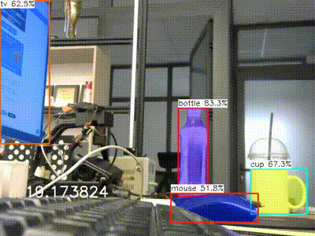

# yolov8_segmentation_ncnn

# How to build ubuntu 20.04
## 1. Git clone ncnn repo with submodule
```
cd yolov8_segmentation_ncnn
git clone https://github.com/Tencent/ncnn.git 
cd ncnn
git submodule update --init
cd ncnn
mkdir -p build
cd build
cmake -DCMAKE_BUILD_TYPE=Release -DNCNN_VULKAN=ON ..
make -j$(nproc)
make install
```
[reference](https://github.com/Tencent/ncnn/wiki/how-to-build#raspberry-pi)

## 2. Add path ncnn to CMakeLists.txt

```
#NCNN
set(ncnn_DIR ./ncnn/build/install/lib/cmake/ncnn)
find_package(ncnn REQUIRED)
```

## 3. Build project
```
cd yolov8_segmentation_ncnn
mkdir -p build && cd build
cmake ../
```

## 4.Results

<div align="center">
<p>

</p>

## 5. How to convert model
```

```
